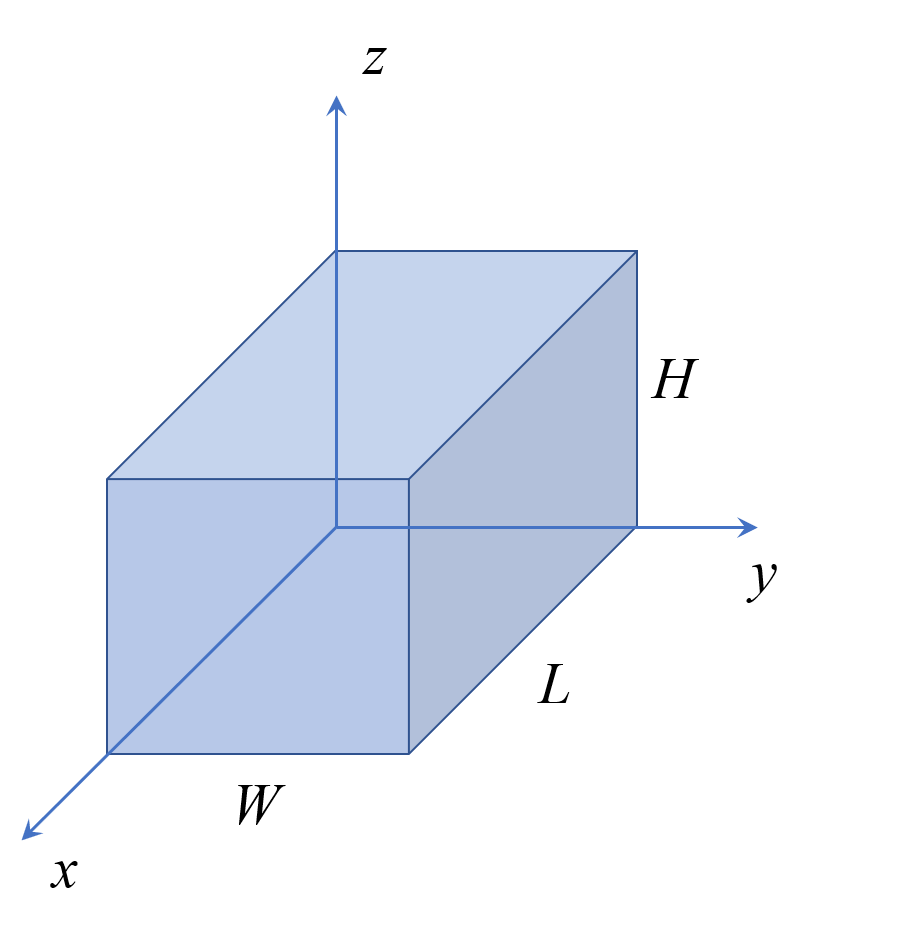
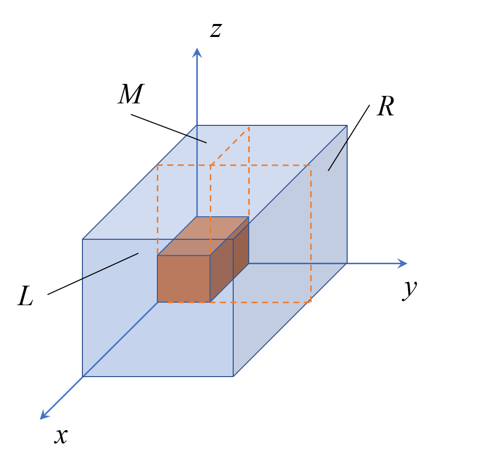

# Notation

| Notation        | Meaning                                                      |
| --------------- | ------------------------------------------------------------ |
| $(l_i,w_i,h_i)$ | Parameters indicating the length, width and height of cargo $i$.(with its direction) |
|$(l_{tk},w_{tk},h_{tk})$| Parameter indicating the length width and height of cargo of type $k$. |
| $(x_i,y_i,z_i)$ | Position of the BLB corner of the cargo $i$.                |
| $(p_j,q_j,r_j)$ | Position of the empty space $j$.                            |
| $(L_j,W_j,H_j)$ | Parameters indicating the length, width and height of  empty space $j$. |
| $s_i$           | A binary variable which is equal to 1 if cargo number $i$ is placed in the container, otherwise is equal to 0. |
| $t_i$           | A integer variable indicating the type of cargo $i$.         |
| $k_i$           | A integer variable indicating the direction of cargo $i$ when it is placed in container. |
| $A$ | Packing scheme encode to a array. |
| $\alpha_t$ | An array shows that when the direction index is t, the side pallarels to side $L$. |
| $\beta_t$ | An array shows that when the direction index is t, the side pallarels to side $W$. |
| $\theta_t$ | An array shows that when the direction index is t, the side pallarels to side $H$. |
| $(L,W,H)$ | Parameters indicating the length, width and height of container. |
| | |

# The Container Loading Model

## Assumptions

 In this model we focus on how can we load the container with cargos as much as possible. For this container loading problem (CLP),  we specify roles as follow:

- All cargos are load-bearing and allow several cargos to be put on them.
- Cargos are all cube. 
- The side of each cargo must be parallel to the side of container. In addition, every cargo can rotate, roll and be upside-down.

## Problem Description

The length, width and height of the container is equal to $L$, $W$ and $H$. We have 11 types of cargos, their size is shown in Table.

//table

If $N$ is the maximun total number of the cargos, the problem is therefore formulated as the following linear mixed integer programming model:
$$
\max \sum_{i=1}^Nl_iw_ih_i s_i/LWH
\label{eqa}
$$

subject to the volume constrain
$$
\sum_{i=1}^{N}l_iw_ih_is_i \le LWH
\label{ebc}
$$
where $l_i$, $w_i$ , $h_i$ is the parameters indicating the length, width and height of cargo $i$.
$$
\begin{equation}
l_j\leq L_j\\
w_j\leq W_j\\
h_j\leq H_j
\label{3a}
\end{equation}
$$
In order to describe all the location of the cargo, the coordinate system is defined as fig.

### Containing Stragety

First, we consider the cargos’ direction to be put in the container. The table indicates the relationship between the parameter and direction of three side of the cargos.

| State No. ($b_i$)                      | 1        | 2        | 3        | 4        | 5        | 6        |
| -------------------------------------- | -------- | -------- | -------- | -------- | -------- | -------- |
| Parallel to $L$($l_i$): $\alpha_{b_i}$ | $l_{tk}$ | $w_{tk}$ | $h_{tk}$ | $l_{tk}$ | $w_{tk}$ | $h_{tk}$ |
| Parallel to $W$ ($w_i$):$\beta_{b_i}$  | $w_{tk}$ | $l_{tk}$ | $l_{tk}$ | $h_{tk}$ | $h_{tk}$ | $w_{tk}$ |
| Parallel to $H$ ($h_i$):$\theta_{b_i}$ | $h_{tk}$ | $h_{tk}$ | $w_{tk}$ | $w_{tk}$ | $l_{tk}$ | $l_{tk}$ |

To describe the position of each cargos or each empty elemet space, we define the coordinate of each cargo is its back-left bottom (BLB) corner. 

Before introducing the containing stragety of cargos, we’d like to introduce how is the space of  the container been divided. When there is no cargo in the container, there is only one empty space, descricbed as array $(0,0,0,L,W,H)$, where $(0,0,0)$ means the coordinate of the BLB corner of the space and $(L,W,H)$ indicates the length, width and height of the space. When a cargo is put in the container, the original space is divided into three parts (fig), front part (marked as L), right part (marked as R) and upside part (marked as M). Therefore the original space is diappeared, replaced with L, R and M. When the next cargo is put in, the space that it occupies is divided into three parts in the same way.

The empty space $j$ is temporarily described as a array $(p_j,q_j,r_j,L_j,W_j,H_j)$, where$(p_j,q_j,r_j)$ indicates the position of the BLB corner and $(L_j,W_j,H_j)$ indicates the length, width and height of the space. These information will be stored in matrix $L, R, M$ in sequence.

When the next cargo is put in the container, we search the empty space in the order of that right space first, upside space second and front space the last. The later the space is stored in matrix L, R or M, the earlier it is compared with the cargo size. The constrain is formulated as eq.$\eqref{3a}$.

Once the eligible empty space $j$ is find, the specific space is divided into three parts and cargo $i+1$ will be put in the container. Therefore the variable $s_i$ is equal to 1. If none of the space can  is suitable for the constrain $\eqref{3a}$, $s_j$ is equal to 0.

### Encoding and decoding

To know how the cargoas are put in the container, we encode the packing scheme into the array $A$,
$$
A=(a_1\dots a_N,a_{N+1}\dots a_{2N})
$$
where $(a_1\dots a_i\dots a_N)$ is the type numer of cargo $i$, $(a_N\dots a_{i+N}\dots a_N)$ is the direction state of cargo $i$. It means that cargo $i$, which is type $a_i$, is packed with the direction $a_{i+N}$.

This array can be decoded as follow:
$$
(l_i, w_i, h_i)=(\alpha_{a_{i+N}},\beta_{a_{i+N}},\theta_{a_{i+N}})\in\{permutation (l_{ta_i},w_{ta_i},h_{ta_i})\}
$$
Then follow the containing roles in the order of $(a_1\dots a_N)$, we can get all the information about the container, cargo and empty space.

## Solve the Problem

To solve problem $\eqref{eqa}$ subject to $\eqref{ebc}\eqref{3a}$, heuristic algorithm (HA) and Simulated Annealing(SA) are used to get the feasible solution.

Firstly, the given number of drones are placed in the container in the range of size, then the small medical package. This is what HA does. It simulated the order of the cargos to be put in the container. Under the premise that all the package meet all the requirements, medical packages will be placed in the container as many as possible to fill up the container. 

Next, we use SA to optimize the sequence of the solution, in order to pack more cargos in the container.

